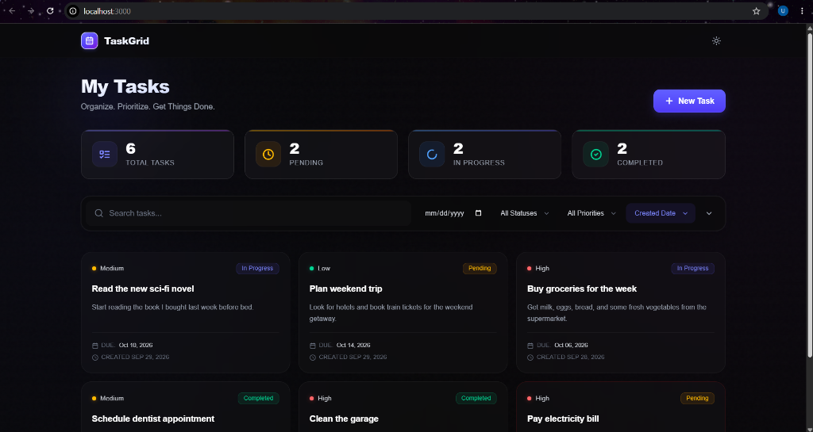
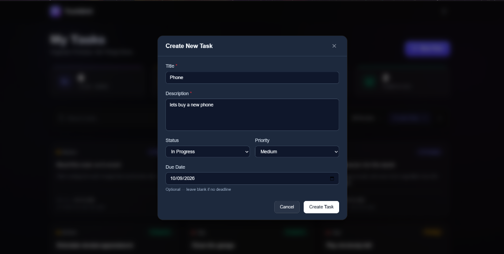
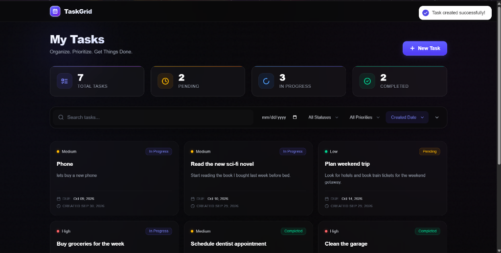

# 📋 TaskGrid — Full-Stack Task Management System

A production-quality, full-stack task management application built with **React + Vite** (frontend) and **Node.js + Express** (backend). Features a beautiful, responsive UI with dark mode, real-time filtering, search, pagination, and complete CRUD operations.

---

## ✨ Features

### Core
- ✅ **Dashboard** — responsive task grid with cards showing all task info
- ✅ **Create Task** — modal form with client-side validation
- ✅ **Edit Task** — pre-filled form with all existing data
- ✅ **View Task** — full-detail modal with overdue indicators
- ✅ **Delete Task** — confirmation modal before deletion
- ✅ **Loading / Empty / Error states** — graceful UI for all states

### Bonus
- 🔍 **Debounced search** — search by title or description (500ms debounce)
- 🎛️ **Filter** by status (pending / in_progress / completed) and priority (low / medium / high)
- 📊 **Sort** by created date, due date, or priority (ascending/descending)
- 📄 **Pagination** — configurable page size, smart ellipsis navigation
- 🌙 **Dark mode** — system-preference aware, persisted to localStorage
- 📈 **Stats bar** — live task counts by status

---

## 🏗️ Tech Stack

| Layer     | Technology                                |
|-----------|-------------------------------------------|
| Frontend  | React 19, Vite 6, Tailwind CSS v4         |
| Backend   | Node.js 24, Express 4                     |
| API Style | REST                                      |
| Storage   | In-memory (array) — no database required  |
| UI Icons  | Lucide React                              |
| Toasts    | React Hot Toast                           |
| Modals    | Headless UI                               |
| HTTP      | Axios                                     |

---

## 📁 Project Structure

```
cleanomatics_assignment/
├── backend/
│   ├── src/
│   │   ├── routes/
│   │   │   └── task.routes.js        # Express router
│   │   ├── controllers/
│   │   │   └── task.controller.js    # Request/response handlers
│   │   ├── services/
│   │   │   └── task.service.js       # Business logic + in-memory store
│   │   ├── middleware/
│   │   │   ├── errorHandler.js       # Centralized error handling + asyncHandler
│   │   │   └── validate.js           # express-validator rules
│   │   ├── app.js                    # Express app setup
│   │   └── server.js                 # HTTP server entry point
│   ├── .env
│   ├── .env.example
│   └── package.json
│
└── frontend/
    ├── src/
    │   ├── services/
    │   │   └── api.js                # Axios instance + taskApi methods
    │   ├── hooks/
    │   │   ├── useTasks.js           # All task state + CRUD + debounce
    │   │   └── useTheme.js           # Dark mode toggle
    │   ├── utils/
    │   │   └── helpers.js            # Date format, color, label helpers
    │   ├── components/
    │   │   ├── ui/                   # Reusable UI primitives
    │   │   │   ├── Badge.jsx
    │   │   │   ├── Button.jsx
    │   │   │   ├── Modal.jsx
    │   │   │   ├── Spinner.jsx
    │   │   │   ├── EmptyState.jsx
    │   │   │   ├── ErrorState.jsx
    │   │   │   ├── Input.jsx
    │   │   │   └── Select.jsx
    │   │   ├── layout/
    │   │   │   ├── Header.jsx        # Sticky glass header + stats + theme toggle
    │   │   │   └── Layout.jsx
    │   │   └── tasks/
    │   │       ├── TaskCard.jsx      # Task card with overdue indicator
    │   │       ├── TaskForm.jsx      # Create/Edit form with validation
    │   │       ├── TaskModal.jsx     # Create/Edit modal wrapper
    │   │       ├── TaskDetailModal.jsx
    │   │       ├── TaskFilters.jsx   # Search + filter + sort bar
    │   │       ├── TaskStats.jsx     # Stats summary cards
    │   │       └── Pagination.jsx    # Smart pagination
    │   ├── pages/
    │   │   └── Dashboard.jsx         # Main dashboard page
    │   ├── App.jsx
    │   └── main.jsx
    ├── .env
    ├── .env.example
    └── package.json
```

---

## 🚀 Getting Started

### Prerequisites

- **Node.js** v18 or higher
- **npm** v8 or higher

### 1. Clone the repository

```bash
git clone https://github.com/YOUR_USERNAME/task-manager.git
cd task-manager
```

### ⚡ Quick Start (Monorepo root)

You can run everything from the project root:

```bash
# Install all dependencies for both backend and frontend
npm run install:all

# Run backend automated integration tests
npm test

# In terminal 1: Start backend (http://localhost:5000)
npm run dev:backend

# In terminal 2: Start frontend (http://localhost:3000)
npm run dev:frontend
```

---

### Manual Setup (Separate terminals)

#### 1. Setup Backend

```bash
cd backend

# Install dependencies
npm install

# Start the development server (with auto-reload)
npm run dev

# Run automated API integration tests
npm test
```

Backend runs at: **http://localhost:5000**

#### 2. Setup Frontend

```bash
cd frontend

# Install dependencies
npm install

# Start the development server
npm run dev
```

Frontend runs at: **http://localhost:3000**

---

## ⚙️ Environment Variables

### Backend (`backend/.env`)

| Variable       | Default                    | Description                        |
|----------------|----------------------------|------------------------------------|
| `PORT`         | `5000`                     | Port for the Express server        |
| `FRONTEND_URL` | `http://localhost:3000`    | Allowed CORS origin                |
| `NODE_ENV`     | `development`              | Node environment                   |

### Frontend (`frontend/.env`)

| Variable             | Default                  | Description             |
|----------------------|--------------------------|-------------------------|
| `VITE_API_BASE_URL`  | `http://localhost:5000`  | Backend API base URL    |

---

## 📡 API Reference

Base URL: `http://localhost:5000/api`

### Health Check

```
GET http://localhost:5000/
```
Returns server status and timestamp.

---

### `GET /tasks`

Get all tasks with optional filtering, sorting, and pagination.

**Query Parameters:**

| Parameter   | Type   | Default     | Description                                    |
|-------------|--------|-------------|------------------------------------------------|
| `search`    | string | —           | Search in title and description (case-insensitive) |
| `status`    | string | —           | Filter: `pending` \| `in_progress` \| `completed` |
| `priority`  | string | —           | Filter: `low` \| `medium` \| `high`            |
| `sortBy`    | string | `createdAt` | Sort field: `createdAt` \| `updatedAt` \| `dueDate` \| `priority` |
| `sortOrder` | string | `desc`      | `asc` \| `desc`                                |
| `page`      | number | `1`         | Page number                                    |
| `limit`     | number | `10`        | Items per page (max 100)                       |

**Response `200`:**
```json
{
  "success": true,
  "data": {
    "tasks": [...],
    "pagination": {
      "total": 42,
      "page": 1,
      "limit": 10,
      "totalPages": 5
    }
  }
}
```

---

### `GET /tasks/stats`

Get aggregate counts by status and priority.

**Response `200`:**
```json
{
  "success": true,
  "data": {
    "total": 42,
    "pending": 15,
    "in_progress": 12,
    "completed": 15,
    "low": 10,
    "medium": 20,
    "high": 12
  }
}
```

---

### `GET /tasks/:id`

Get a single task by ID.

**Response `200`:**
```json
{
  "success": true,
  "data": {
    "id": "550e8400-e29b-41d4-a716-446655440000",
    "title": "Complete assignment",
    "description": "Build the full-stack task manager",
    "status": "pending",
    "priority": "high",
    "dueDate": "2026-10-05T00:00:00.000Z",
    "createdAt": "2026-09-29T00:00:00.000Z",
    "updatedAt": "2026-09-29T00:00:00.000Z"
  }
}
```

**Response `404`:**
```json
{ "success": false, "message": "Task not found" }
```

---

### `POST /tasks`

Create a new task.

**Request Body:**
```json
{
  "title": "Complete assignment",
  "description": "Build the full-stack task manager",
  "status": "pending",
  "priority": "high",
  "dueDate": "2026-10-05"
}
```

| Field         | Required | Type   | Constraints              |
|---------------|----------|--------|--------------------------|
| `title`       | ✅       | string | 1–200 characters         |
| `description` | ✅       | string | 1–2000 characters        |
| `status`      | ❌       | string | `pending` (default)      |
| `priority`    | ❌       | string | `medium` (default)       |
| `dueDate`     | ❌       | string | ISO 8601 date            |

**Response `201`:**
```json
{
  "success": true,
  "message": "Task created successfully",
  "data": { ...task }
}
```

**Response `400`** (validation error):
```json
{
  "success": false,
  "message": "Validation failed",
  "errors": [
    { "field": "title", "message": "Title is required" }
  ]
}
```

---

### `PUT /tasks/:id`

Update an existing task (all fields optional except constraints).

**Request Body:** Same shape as POST.

**Response `200`:**
```json
{
  "success": true,
  "message": "Task updated successfully",
  "data": { ...updatedTask }
}
```

**Response `404`:** Task not found.

---

### `DELETE /tasks/:id`

Delete a task.

**Response `200`:**
```json
{
  "success": true,
  "message": "Task deleted successfully",
  "data": { ...deletedTask }
}
```

**Response `404`:** Task not found.

---

## 🧩 Task Data Model

```json
{
  "id": "uuid-v4",
  "title": "string (1-200 chars)",
  "description": "string (1-2000 chars)",
  "status": "pending | in_progress | completed",
  "priority": "low | medium | high",
  "dueDate": "ISO 8601 string | null",
  "createdAt": "ISO 8601 string",
  "updatedAt": "ISO 8601 string"
}
```

---

## 🎨 Design Decisions

- **In-memory store**: Tasks are stored in a JavaScript array on the backend. Data resets on server restart (by design, per requirements).
- **Axios interceptor**: The response interceptor unwraps `response.data` automatically, so service functions receive clean API payloads.
- **Debounced search**: Search input waits 500ms after the user stops typing before hitting the API, preventing unnecessary requests.
- **Pagination + filter reset**: Changing any filter (search, status, priority, sort) resets the page back to 1 automatically.
- **Dark mode**: Uses Tailwind's `dark:` variant with a class strategy (`class` mode). Preference is saved to `localStorage` and initialized from `prefers-color-scheme`.
- **asyncHandler**: All controller functions are wrapped in an `asyncHandler` HOF that catches async errors and passes them to Express's centralized error handler.
- **Validation**: Server-side via `express-validator`; client-side via custom validation in the form component with touch-based error display.

---

## 📬 Postman Collection

Import `TaskGrid.postman_collection.json` from the project root into Postman.

The collection includes:
- All 6 endpoints with example requests
- Pre-set environment variable `{{baseUrl}} = http://localhost:5000`
- Example request bodies and expected responses

## 🎥 Video Demo

Watch the 1-minute demo video below to see the UI animations, hover effects, and full CRUD functionality in action:

👉 [**Click here to watch the Demo Video**](https://github.com/wadhwaumeshzira/Taskgrid-Cleanomatics-Assignment/blob/main/demo.mp4) 🎥

---

## 📸 Screenshots

| Main Dashboard | Create Task Modal |
|----------------|-------------------|
|  |  |

| Success State |
|---------------|
|  |

---

## 🌿 Git Conventions

Commits follow the **Conventional Commits** spec:
- `feat:` — new features
- `fix:` — bug fixes
- `refactor:` — code changes that don't fix bugs or add features
- `docs:` — documentation updates
- `chore:` — build process, dependencies

---

## 📜 License

MIT © 2026 — Built for Cleanomatics Assignment
